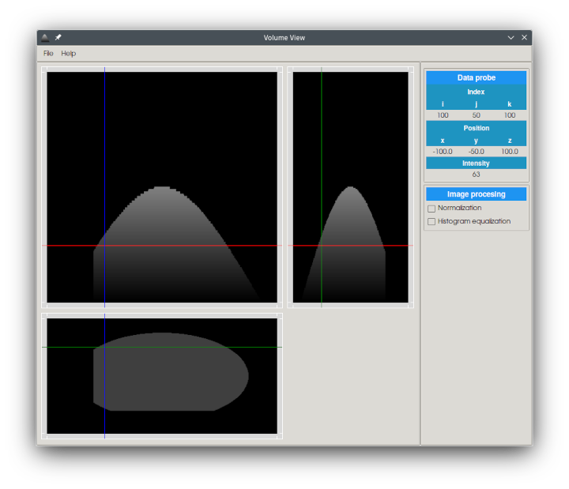

# Volume View
**Volumetric Data Viewer**

---

 

Volume View is for viewing (8/16 bit) volumetric data. It can 

- generate test data

- currently read data in numpy array file format (.npy) and J. Morita CT file format (.vol)

- export data in nearly raw rendering data file format (.nrrd)

It is recommended that installing the required python modules with the command
   
    `pip install -r requirements.txt`
